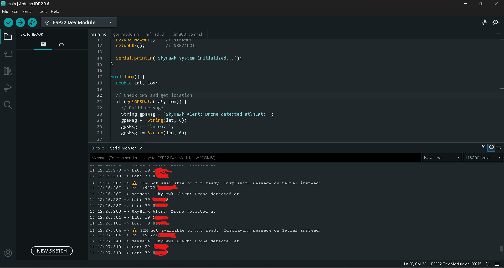
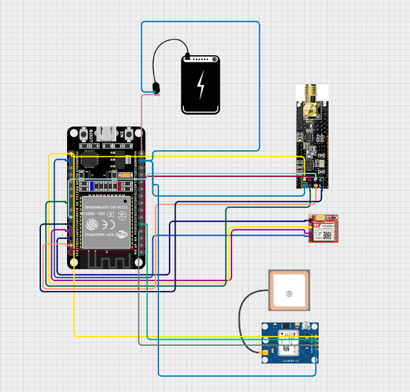

<h1 align="center">SkyHawk 🛰️</h1>

<i>Drone Detection & Jamming Assistant</i>

  

---

## 📡 Live Test Output

> Below is an actual test output from the SkyHawk device in action. GPS location data was successfully retrieved and alerts were generated (SIM was not inserted, so messages were shown via serial):

**SkyHawk** is a lightweight, field-deployable hardware-based cybersecurity tool designed for **drone activity detection and disruption** using GPS spoofing, GSM alerts, and RF communication. It's built around the powerful **ESP32** and integrates key modules like **NEO-6M GPS**, **SIM800L GSM**, and **NRF24L01+PA+LNA**, all powered via a compact USB power bank.

> ⚡️ Created by [Pankaj Kumar](mailto:pankajmouryax0@gmail.com) — Ethical Hacker, Red Team Researcher, and IoT Security Engineer.

---

## 🧠 Table of Contents

- [🔭 About the Project](#about-the-project)
- [📦 Hardware Used](#hardware-used)
- [🎯 Features](#features)
- [📡 How It Works](#how-it-works)
- [⚙️ Setup Instructions](#setup-instructions)
- [💡 Usage Guide](#usage-guide)
- [📸 Images](#images)
- [🤝 Contributing](#contributing)
- [📜 License](#license)

---

## 🔭 About the Project

SkyHawk is developed for ethical hacking and red teaming scenarios where drone surveillance, infiltration, or unauthorized aerial reconnaissance may pose a threat. With zero GUI components, it's stealthy, power-efficient, and designed for real-time monitoring and jamming using GPS manipulation and RF signals.

---

## 📦 Hardware Used

| Component              | Description                                             |
|------------------------|---------------------------------------------------------|
| ESP32 Dev Board        | Dual-core WiFi + Bluetooth microcontroller              |
| NEO-6M GPS             | To read location and manipulate GPS data                |
| SIM800L GSM Module     | Sends alert SMS messages over 2G GSM networks           |
| NRF24L01+PA+LNA        | Long-range 2.4GHz RF communication for drone signal play |
| Power Bank             | Portable power source for mobile deployment             |
| Jumpers/Breadboard     | Temporary connections for prototyping                   |

---

## 🎯 Features

- ✅ Real-time GPS location tracking
- ✅ SMS alerts via GSM (SIM800L)
- ✅ RF-based drone communication mimicry (NRF24L01)
- ✅ Minimal power consumption
- ✅ Modular and customizable codebase
- ✅ Ready for red team and IoT pentesting scenarios

---

## 📡 How It Works

1. **Boot**: ESP32 initializes modules.
2. **Location Fetch**: NEO-6M retrieves real-time GPS coordinates.
3. **Transmission**:
    - Sends GPS data via GSM to a target number.
    - Sends RF packets for drone spoofing/jamming.
4. **Automation**: Can be customized to detect coordinates or patterns triggering jamming.

---

## ⚙️ Setup Instructions

### 1. **Prepare Your Hardware**
- Follow the wiring diagram provided in `wiring_diagrams/circuit.png`.
- Insert a micro SIM into the SIM800L.
- Use a 5V USB power bank or regulated 3.7–4.2V Li-ion battery for SIM800L.

### 2. **Install Arduino Dependencies**

Install via Arduino IDE or `platformio`:
- `TinyGPS++`
- `SoftwareSerial`
- `SPI`
- `RF24` by TMRh20

### 3. **Upload Code**
Place all `.ino` and `.h` files in `/src`, open `main.ino` in Arduino IDE, and flash to ESP32.

---

## 💡 Usage Guide

| Task                       | Steps |
|----------------------------|-------|
| 📍 Get GPS Location        | Auto starts and logs via serial |
| 📤 Send SMS Alert          | Automatically on location fetch |
| 📶 Jam RF Drone Signals    | NRF24 sends burst packets |
| 🛠️ Customize Functions     | Edit `main.ino` and headers as needed |

---

## 📸 Images

**Wiring Preview**  

  

---
## 🤝 Contributing

You're welcome to contribute:

- Fork this repo
- Add features (e.g., LoRa support, IR TX, OLED UI)
- Submit pull requests
- Report issues

---

## 📜 License

This project is licensed under the MIT License. See `LICENSE.md` for details.

---

> **SkyHawk** is a proof-of-concept tool designed for **educational and red team research purposes only**. It must **not** be used to disrupt legal drone operations.
